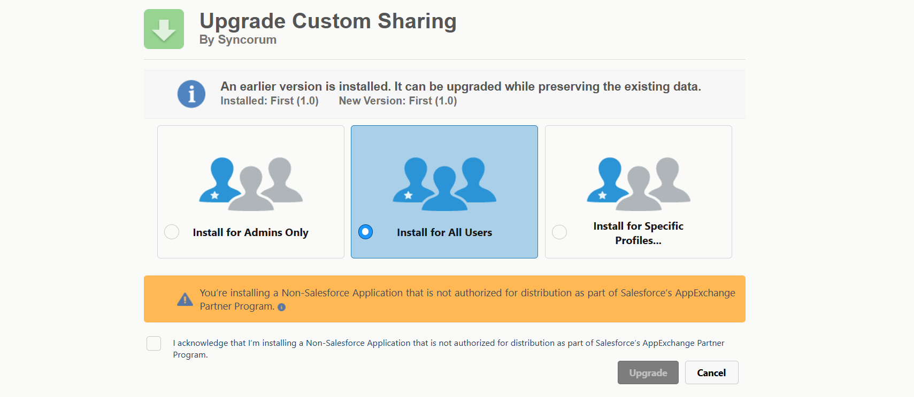
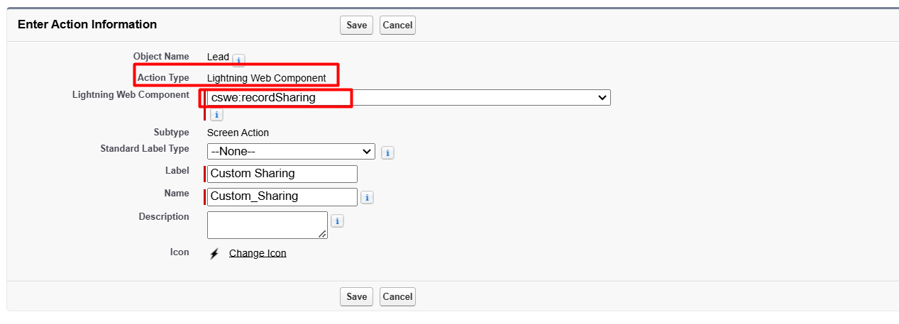
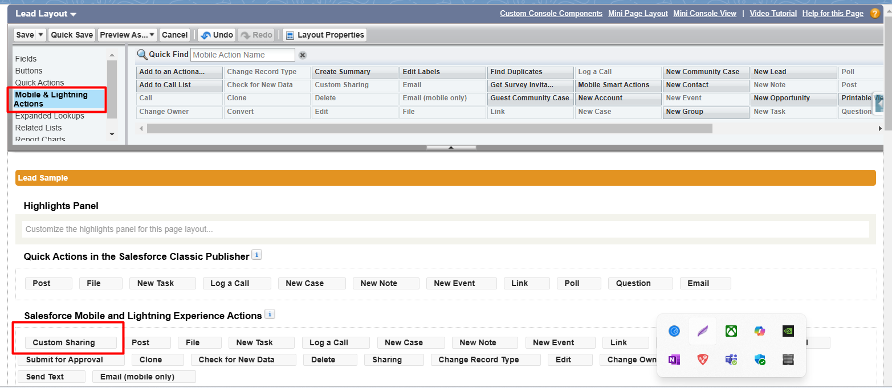
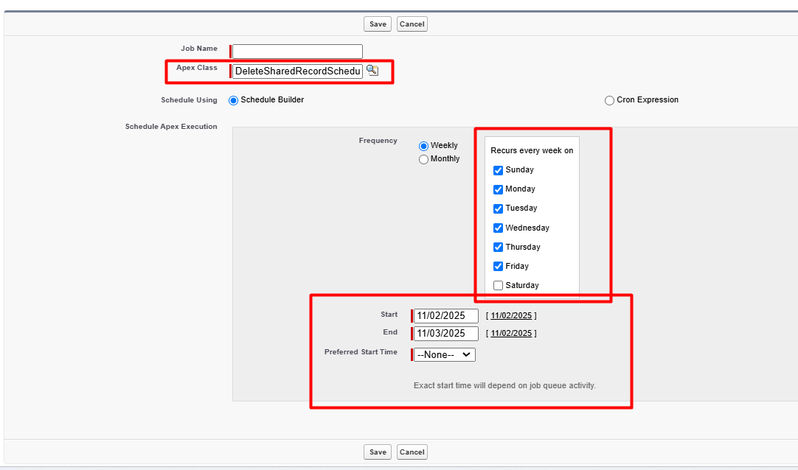

# Salesforce-Custom-Sharing
A Salesforce package that enables users to share records with external users while setting an expiration date. This ensures enhanced data security by automatically revoking access after the defined period. The package includes a Lightning Web Component for sharing records, a scheduled Apex job for automatic cleanup, and an easy installation guide.

## Problem Statement
Many organizations and individuals often need to share sensitive files or records with external users, such as clients, partners, or colleagues. However, there is no built-in expiration date for these shared files, which can pose a security risk if the shared content remains accessible indefinitely. 

The challenge is to develop a solution that allows users to set an expiration date for shared files, ensuring that the recipients can only access the content for a limited time and enhancing data security.

## Solution
This Salesforce package enables users to share records with external users while setting an expiration date. It includes:
- A **Lightning Web Component** for sharing records.
- A **Scheduled Apex Job** for automatic cleanup of expired shared records.
- A **Custom Action Button** for easy record sharing.
- A **Permission Set** to control user access.

## Installation Guide

### 1. Install the Package
1. Open a browser and go to: [Salesforce Package Installation Link](https://login.salesforce.com/packaging/installPackage.apexp?p0=04tQy0000005rgP)
2. Install the package. 

### 2. Assign Permission Set to the User
1. Search for the user in **Quick Find**.
2. Click on the **User**.
3. Click on **Permission Set Assignment**.
4. Select **Sharing Record Permission** and Save.

### 3. Create a Custom Action Button for Sharing in an Object
1. Go to **Object Manager** and click on **Buttons, Links, and Actions**.
2. Click on **New Action**.
3. Select **Action Type** as **Lightning Web Component**.
4. In **Lightning Web Component**, select **recordSharing**.
5. Save the action.

### 4. Add the Action to the Page Layout
1. Go to **Page Layout** for the object.
2. Click on **Mobile & Lightning Actions**.
3. Drag the created action to **Salesforce Mobile and Lightning Experience Actions**.
4. Save the layout.

### 5. Schedule the Apex Class for Deleting Expired Shared Records
1. Search for **Scheduled Jobs** in **Quick Find**.
2. Click on **Schedule Apex**.
3. Enter **Job Name** as `DeleteSharedRecordSchedulable`.
4. Select **All Days** and set the **Start Date** and **End Date**.
5. Select a **Time** and Save.

## Contributing
We welcome contributions! If you'd like to improve the package, submit a pull request or raise an issue.
